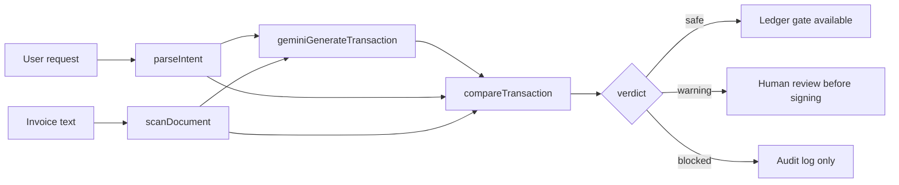
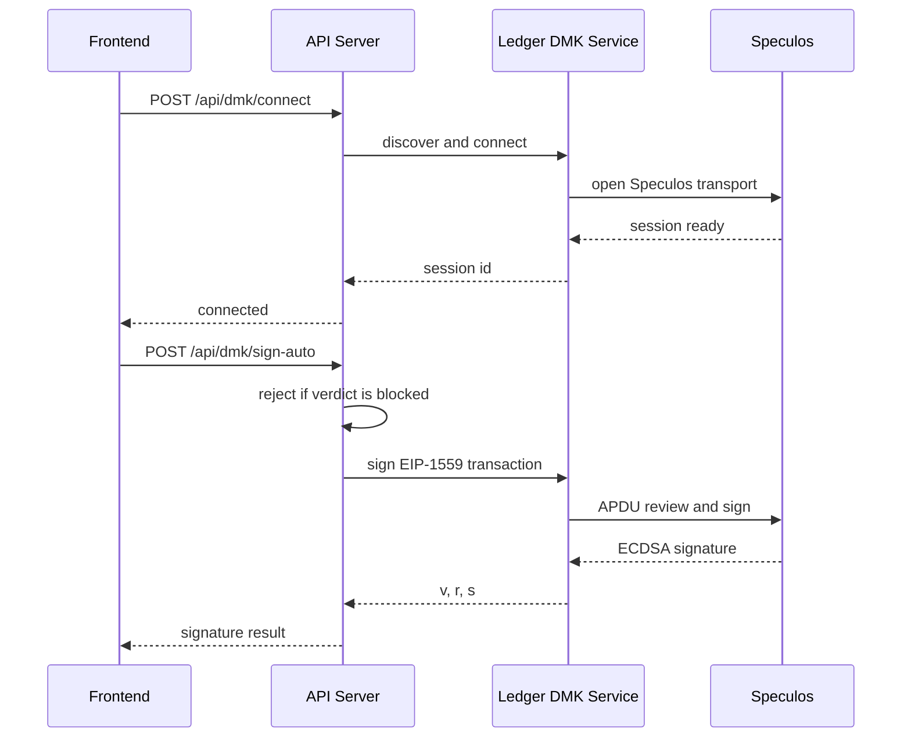

# Architecture Guide

SignScope is organized as a pnpm workspace. The frontend, backend, and shared API packages are separated so the demo can stay readable while still using typed contracts.

## Runtime Flow

## Frontend

`artifacts/signscope` contains the React/Vite app. It uses route-based pages under `src/pages`, shared UI components under `src/components`, and client helpers under `src/lib`.

Key pages:

- `IntentLab.tsx` - full Request Check pipeline demo.
- `LedgerGate.tsx` - signing gate and verdict review.
- `SpeculosDmk.tsx` - DMK plus Speculos proof flow.
- `AuditLogs.tsx` - full event trail.
- `Settings.tsx` - feature flags and runtime controls.

## Backend

`artifacts/api-server` contains the Express API and services.

Key files:

- `src/routes/requestCheck.ts` - the single end-to-end pipeline endpoint.
- `src/routes/signscope.ts` - individual parse, scan, compare, audit, settings, and wallet-cli endpoints.
- `src/routes/dmk.ts` - Ledger DMK and Speculos endpoints.
- `src/services/gemini.ts` - Gemini transaction generation.
- `src/services/compareTransaction.ts` - deterministic final safety diff.
- `src/services/auditLog.ts` - local audit trail.

## Shared Packages

| Package | Purpose |
| --- | --- |
| `lib/api-spec` | OpenAPI source contract |
| `lib/api-zod` | Generated Zod/types package |
| `lib/api-client-react` | Generated React client package |
| `lib/db` | Shared database schema package |

## Ledger Path

The important security point is that blocked transactions stop in the API before any signing call is made.
