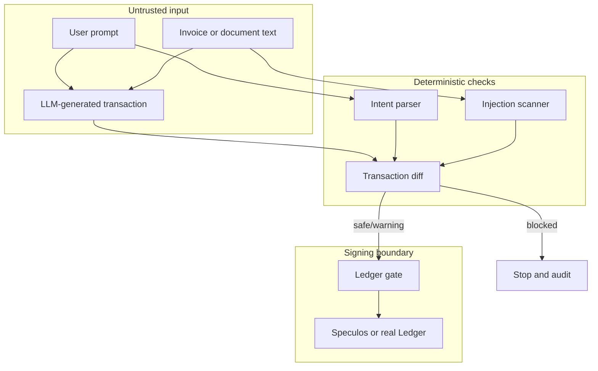

# Security Model

SignScope is designed around one core rule: an AI agent may suggest a payment, but it must not be trusted to authorize that payment.

## Trust Boundaries

## Security Properties

- The LLM response is treated as untrusted.
- The final verdict is produced by deterministic code, not by the LLM.
- A blocked verdict prevents Ledger and wallet-cli signing attempts.
- The API records audit events for important pipeline stages.
- Real signing is off by default.
- Gemini credentials are read by the server only.
- `.env` and runtime `data/` files are git-ignored.

## Verdict Meaning

| Verdict | Meaning | Signing Behavior |
| --- | --- | --- |
| `safe` | Intent, scan, and transaction agree | Signing path can be made available |
| `warning` | Something is unusual but not necessarily malicious | Human review should happen before signing |
| `blocked` | Critical mismatch or malicious instruction found | Transaction is dropped before signing |

## Production Notes

This repository is a proof of concept. A production system would need stronger document parsing, policy management, allowlists, rate limiting, authentication, centralized audit storage, key management review, threat modeling, and independent security testing.
